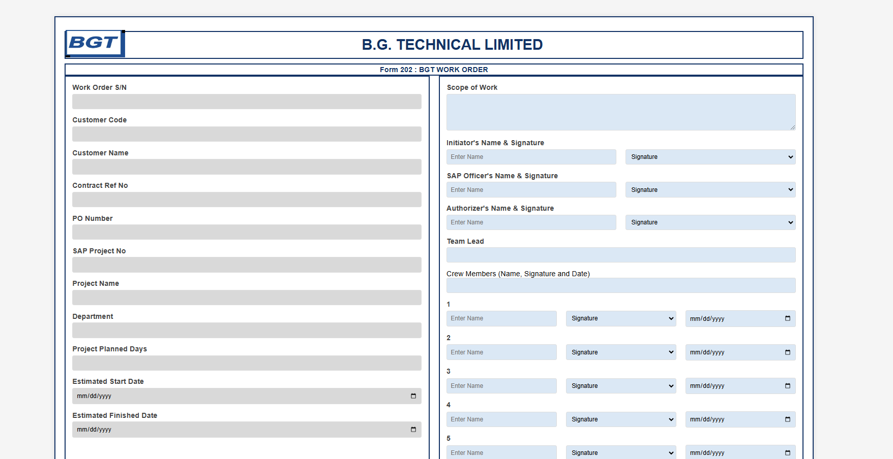

# B.G. TECHNICAL LIMITED  
**Dynamic Work Order Form 📋**  

This project showcases a **responsive and professional Work Order Form** designed for B.G. Technical Limited. The form combines functionality, aesthetics, and adaptability to streamline project management, data collection, and team collaboration. 🌟  

---

## **WORK ORDER FORM** 🏗️  

### Features 🌟  

- **Form 202 Compliance**: Adheres to B.G. Technical Limited’s Form 202 standards for work order tracking and management.  
- **Detailed Project Information**: Captures essential details, including Work Order S/N, Customer Code, Project Name, SAP Project Number, and more. 📋  
- **Scope Tracking**: Dedicated sections to document the scope of work, additional scopes completed, and invoicing requirements. 📈  
- **Team Management**: Includes fields for team leads and crew members with their names, signatures, and task completion dates. 🧑‍🤝‍🧑✍️  
- **Approval Workflow**: Features signature fields for initiators, SAP officers, project leaders, operations managers, and invoicing officers to ensure accountability and proper authorization. ✅  
- **Completion Certificate**: Integrated internal work completion certificate to streamline project closure processes. 📜  
- **Responsive Design**: Fully adaptable for use on desktops, tablets, and mobile devices. 📱💻  
- **Professional Styling**: Clean and structured layout with branding consistency, including company logo and relevant identifiers. 🎨 

---

## **Preview Demo 📸**  

Below are two sample previews of the **BGT Work Order Form**:  

### Preview 1  
  

### Preview 2  
  

---

## Topics Covered 📝 

1. **Dynamic Field Design**: Designing expandable and editable fields for complex workflows. 🏗️  
2. **Responsive Layouts**: Creating forms that adapt to various screen sizes. 📱💻  
3. **Form Validation**: Ensuring data accuracy and completeness. ✅  
4. **Role-Based Access**: Assigning responsibilities with signature authentication for accountability. 🖊️  
5. **Professional Branding**: Integrating company logos and maintaining a cohesive visual identity. 🎨 

---

## Technologies Used 🛠️  

- **HTML5**: For a semantically structured and accessible layout. 🔧  
- **CSS3**: For visually appealing and responsive designs. 🎨 

---

## How to Use 🚀  

1. **Form Completion**: Input all necessary project and customer details into the respective fields.  
2. **Team Collaboration**: Document team members’ details, including names, signatures, and task completion dates.  
3. **Approval Workflow**: Obtain necessary approvals from authorized personnel using signature fields.  
4. **Completion Certificate**: Validate and confirm project closure with the integrated internal work completion certificate.  
5. **Preview & Submit**: Use the preview feature to verify inputs before submission or printing.  

---

## Skills You'll Gain 💡  

- Building **industry-standard work order forms** for efficient project management.  
- Designing **responsive layouts** for adaptability in various environments.  
- Structuring workflows for **team collaboration and accountability.**  
- Maintaining **corporate branding** through cohesive designs.  

---

## Hashtags 🔖  

#WorkOrderForm #ProjectManagement #ResponsiveDesign #Bootstrap #HTML5 #CSS3  

---  

**Thank you for exploring the B.G. Technical Limited Work Order Form! This form is designed to simplify project tracking, improve collaboration, and ensure effective workflow management.** 🌟💼  
